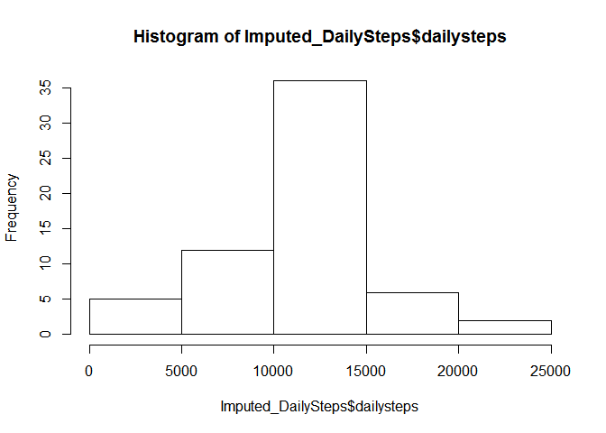

# Reproducible Research: Peer Assessment 1
Setup environment

```r
setwd("Y:/RepData_PeerAssessment1")
library("plyr")
library("chron")
library("lattice")
```

## Loading and preprocessing the data
Load data into 'ActivityData' dataframe from working directory

```r
ActivityData<-read.csv("activity.csv",header=TRUE)
```

Create a new datafram 'DailySteps_NoNA' containing total number of steps per day and exclude missing data

```r
DailySteps_NoNA<-ddply(ActivityData,'date',function(x) c(dailysteps=sum(x$steps,na.rm=TRUE)))
```

## Make a histogram of the total number of steps taken each day

```r
hist(DailySteps_NoNA$dailysteps)
```

 

## What is mean total number of steps taken per day?
Answer: Mean and Median of the total number of steps are 9354.23 and 10395 respectively.

## What is the average daily activity pattern?
Use ddply() function to calculate average steps for each 5 minute interval, across all days.  
Ignore missing data and store result in dataframe 'AvgByInterval_NoNA' 

```r
AvgByInterval_NoNA<-ddply(ActivityData,'interval',function(x) c(avgsteps=mean(x$steps,na.rm=TRUE)))
```
Plot average steps per interval

```r
plot(AvgByInterval_NoNA,type="l")
```

 

Now find the row in the dataframe 'AvgByInterval_NoNA' containing the largest value for average steps and display the interval in which that occurs and the average steps

```r
maxstepsinterval<-subset(AvgByInterval_NoNA,avgsteps == max(AvgByInterval_NoNA$avgsteps))
```
Maximum average steps,  206.17, occurs in interval 835

## Imputing missing values
There are 2304 missing values in the data set out of a total of 17568 records.  

Create a new dataframe, 'Imputed_ActivivityData', from the raw ActivityData dataframe, and then replace missing values with the interval mean.

```r
Imputed_ActivityData<-ActivityData
for (i in 1:nrow(Imputed_ActivityData))
{
        if (is.na(Imputed_ActivityData$steps[i])) 
        {
                Imputed_ActivityData[i,"steps"]<-AvgByInterval_NoNA[AvgByInterval_NoNA$interval==Imputed_ActivityData[i,"interval"],"avgsteps"]
        }        
}                
```

Create a new datafram 'Imputed_DailySteps' containing total number of steps per day from the 'Imputed_ActivityData' dataframe

```r
Imputed_DailySteps<-ddply(Imputed_ActivityData,'date',function(x) c(dailysteps=sum(x$steps,na.rm=TRUE)))
```

## Make a histogram of the total number of steps taken each day

```r
hist(Imputed_DailySteps$dailysteps)
```

 

Mean and Median of the total daily steps, using the imputed data, are 10766.19 and 10766.19 respectively  as compared to mean and median, 9354.23 and 10395 of the non imputed data.  Impact of replacing missing values with the mean drives the population mean and median to toward the same, and larger value.

## Are there differences in activity patterns between weekdays and weekends?

Add a column to the Imputed_ActivityData containing the day of the week corresponding to the date and then create a new data frame with 

```r
Imputed_ActivityData<-as.data.frame(append(Imputed_ActivityData, list(daytype=NA)))
Imputed_ActivityData$daytype <- ifelse(is.weekend(as.Date(Imputed_ActivityData$date)), "weekend", "weekday")
Imputed_AvgByInterval<-ddply(Imputed_ActivityData,c('interval','daytype'), function(x) c(avgsteps=mean(x$steps)))
```

Panel plot containing a time series plot of the 5-minute interval (x-axis) and the average number of steps taken, averaged across all weekday days or weekend days (y-axis). 

```r
xyplot(avgsteps ~ interval | daytype,data=Imputed_AvgByInterval, layout=c(1,2),type="l")
```

 
